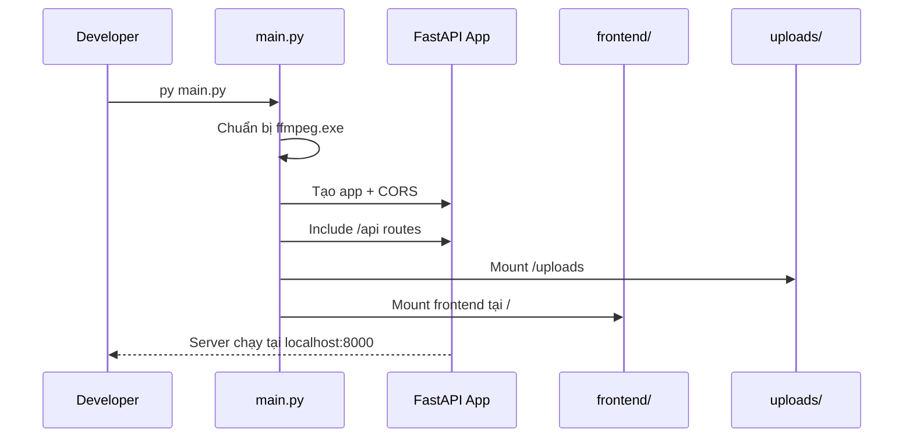
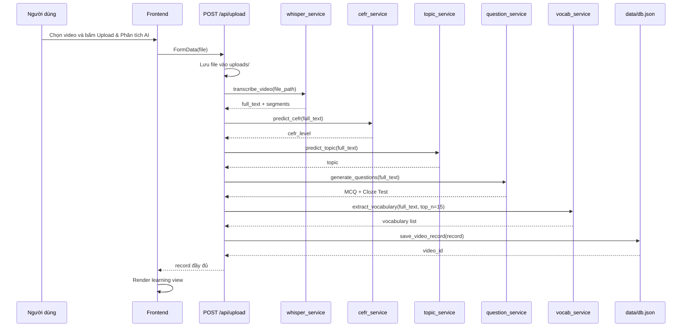
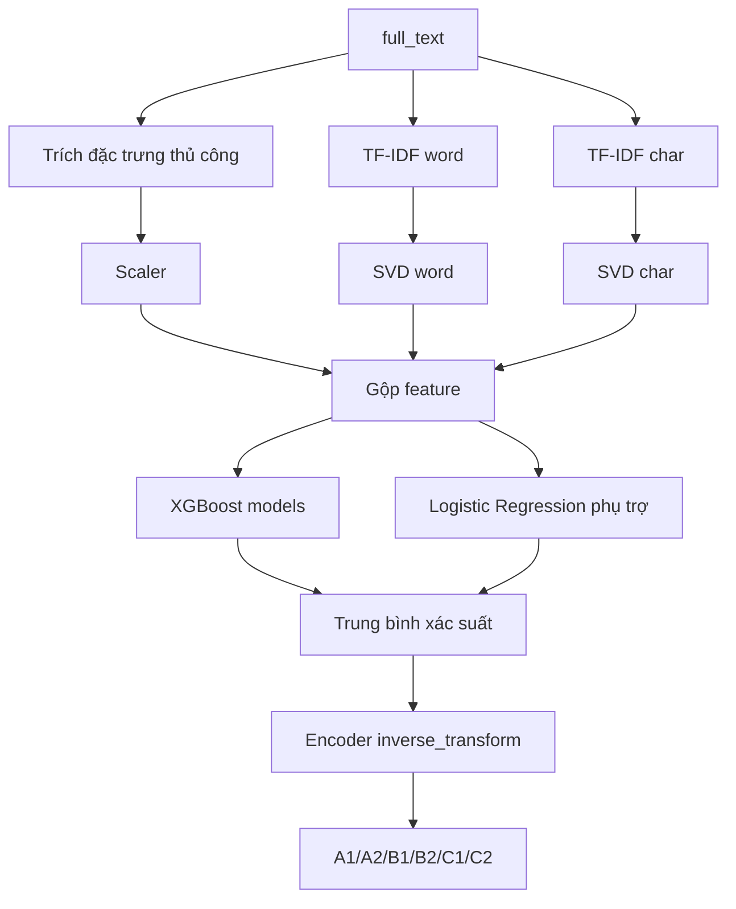
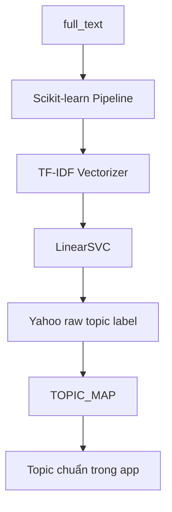
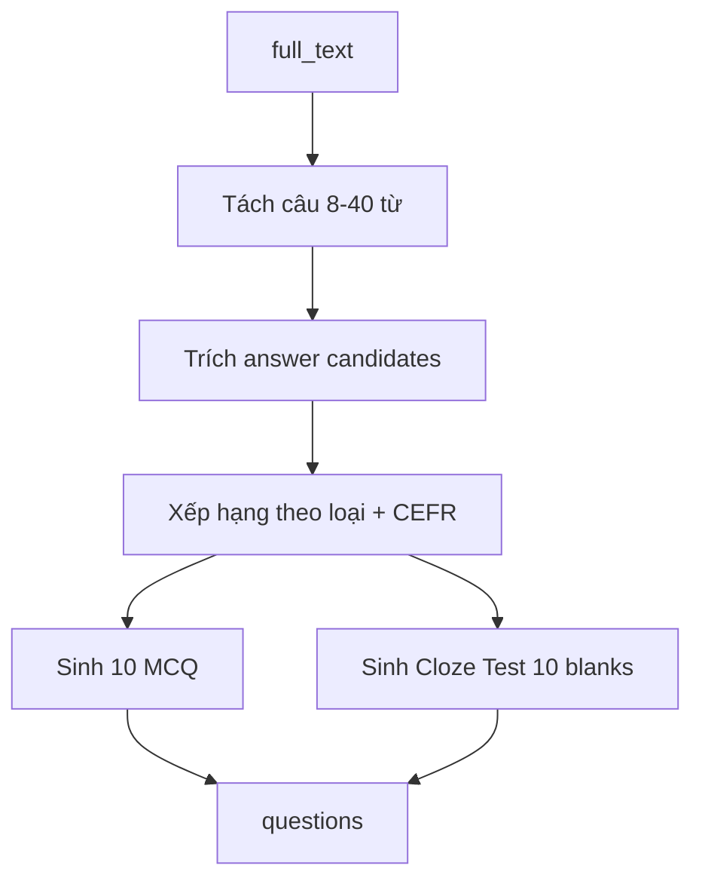
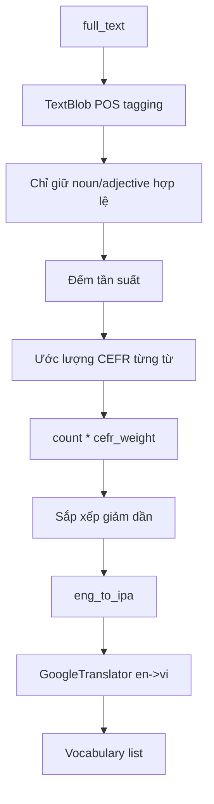
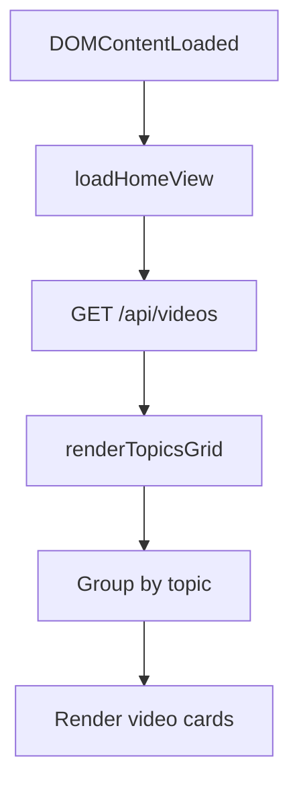

# Luồng nghiệp vụ hệ thống TED AI

> Tài liệu mô tả toàn bộ luồng xử lý của hệ thống TED AI Video App, bao gồm frontend, API, database JSON, các service nhỏ và hai pipeline ML chính:
>
> - **Gán CEFR:** TF-IDF + XGBoost, kết hợp đặc trưng ngôn ngữ thủ công.
> - **Gán Topic:** TF-IDF + LinearSVC.

Ghi chú thuật ngữ: trong tài liệu này dùng tên chuẩn **TF-IDF**. Nếu trong ghi chú ban đầu có viết **TD-IFR** thì được hiểu là **TF-IDF**.

## 1. Tổng quan hệ thống

TED AI là hệ thống học tiếng Anh qua video. Người dùng upload một hoặc nhiều video, hệ thống tự động:

1. Lưu video vào thư mục `uploads`.
2. Trích xuất transcript bằng Whisper.
3. Dự đoán trình độ CEFR của nội dung.
4. Phân loại chủ đề học tập.
5. Sinh câu hỏi luyện tập bằng mô hình T5 Question Generation.
6. Trích xuất từ vựng quan trọng, IPA, CEFR từ vựng và nghĩa tiếng Việt.
7. Lưu kết quả phân tích vào `data/db.json`.
8. Hiển thị lại video, transcript đồng bộ thời gian, câu hỏi, cloze test và vocabulary trên giao diện web.

```mermaid
flowchart LR
    User[Người dùng] --> FE[Frontend HTML/CSS/JS]
    FE -->|POST /api/upload| API[FastAPI Router]
    API --> Uploads[(uploads/)]
    API --> Whisper[Whisper Service]
    Whisper --> Transcript[Transcript full_text + segments]
    Transcript --> CEFR[CEFR Service<br/>TF-IDF + XGBoost]
    Transcript --> Topic[Topic Service<br/>TF-IDF + LinearSVC]
    Transcript --> QG[Question Service<br/>T5 QG]
    Transcript --> Vocab[Vocab Service]
    API --> DB[(data/db.json)]
    FE -->|GET /api/videos| DB
    FE -->|GET /api/videos/{id}| DB
```

## 2. Cấu trúc module chính

| Thành phần | File | Vai trò |
|---|---|---|
| App entrypoint | `backend/main.py` | Khởi tạo FastAPI, CORS, mount frontend, mount uploads, cấu hình ffmpeg cho Whisper |
| API routes | `backend/api/routes.py` | Định nghĩa các endpoint upload, lấy danh sách video, lấy chi tiết video, sinh câu hỏi |
| Database JSON | `backend/database.py` | Đọc, ghi, cập nhật record video trong `data/db.json` |
| Whisper service | `backend/services/whisper_service.py` | Load Whisper `base`, transcribe video thành full text và timestamp segments |
| CEFR service | `backend/services/cefr_service.py` | Dự đoán CEFR bằng bundle `hybrid_bundle_v2.pkl` |
| Topic service | `backend/services/topic_service.py` | Dự đoán topic bằng model `yahoo_10topics_tfidf_linearsvc.joblib` |
| Question service | `backend/services/question_service.py` | Sinh MCQ và Cloze Test bằng `valhalla/t5-base-qg-hl` |
| Vocabulary service | `backend/services/vocab_service.py` | Rút từ vựng quan trọng, IPA, CEFR từng từ, dịch nghĩa |
| CEFR vocab helper | `backend/services/cefr_vocab.py` | Tra cứu `word_list_cefr.csv`, fallback theo độ dài từ, tính trọng số CEFR |
| Frontend | `frontend/app.js` | Upload video, gọi API, render dashboard học tập |
| UI layout | `frontend/index.html` | Cấu trúc trang home, learning view, tabs, video, transcript, câu hỏi |

## 3. Luồng nghiệp vụ tổng thể

### 3.1. Luồng khởi động hệ thống

1. Người dùng chạy:

```powershell
cd E:\DataMining\ted_ai_app\backend
py main.py
```

2. `backend/main.py` thực hiện:

| Bước | Xử lý |
|---|---|
| 1 | Lấy đường dẫn ffmpeg từ `imageio_ffmpeg` |
| 2 | Copy ffmpeg thành `backend/ffmpeg.exe` nếu chưa có |
| 3 | Thêm thư mục `backend` vào biến môi trường `PATH` |
| 4 | Tạo FastAPI app |
| 5 | Bật CORS |
| 6 | Include router với prefix `/api` |
| 7 | Mount `/uploads` để phát video đã upload |
| 8 | Mount `/` để serve frontend |
| 9 | Chạy Uvicorn tại `0.0.0.0:8000` |



### 3.2. Luồng tải danh sách bài học

Khi mở trang chủ:

1. `frontend/app.js` gọi `loadHomeView()`.
2. Frontend gửi request `GET /api/videos`.
3. Backend gọi `database.get_all_videos()`.
4. Database đọc `data/db.json`.
5. Backend chỉ trả metadata nhẹ:

```json
{
  "id": "uuid",
  "filename": "video.mp4",
  "video_url": "/uploads/video.mp4",
  "cefr_level": "B2",
  "topic": "Education"
}
```

6. Frontend group video theo `topic`.
7. Mỗi video được render thành card có tên file, CEFR và nút học ngay.

### 3.3. Luồng upload và phân tích video

Đây là luồng nghiệp vụ quan trọng nhất của hệ thống.



### 3.4. Luồng học một video đã phân tích

Khi người dùng bấm vào một video card:

1. Frontend gọi `GET /api/videos/{video_id}`.
2. Backend đọc record đầy đủ từ `data/db.json`.
3. Frontend gọi `setupLearningEnvironment(data)`.
4. Giao diện hiển thị:

| Khu vực | Dữ liệu hiển thị |
|---|---|
| Video player | `video_url` |
| Badge CEFR | `cefr_level` |
| Badge Topic | `topic` |
| Transcript timestamp | `transcript[].start`, `transcript[].end`, `transcript[].text` |
| Full transcript | Ghép toàn bộ `segments[].text` |
| Reading Comprehension | `questions.multiple_choice` |
| Cloze Test | `questions.cloze_test` |
| Vocabulary | `vocabulary[]` |

5. Khi video chạy, frontend dùng `timeupdate` để highlight transcript line theo timestamp.
6. Khi click vào một dòng transcript, video nhảy tới thời điểm `start` của segment đó.

## 4. Chi tiết các service nhỏ

### 4.1. `whisper_service.py`

Vai trò: chuyển video/audio thành transcript.

| Hàm | Mô tả |
|---|---|
| `load_model()` | Lazy load Whisper model `base`. Model chỉ load một lần trong process |
| `transcribe_video(video_path)` | Gọi `model.transcribe(video_path)`, trả `full_text` và `segments` |

Output mẫu:

```json
{
  "full_text": "Full transcript text...",
  "segments": [
    {
      "start": 0.0,
      "end": 4.2,
      "text": "Segment text"
    }
  ]
}
```

Ghi chú vận hành:

- Khi chạy trên CPU, Whisper cảnh báo `FP16 is not supported on CPU; using FP32 instead`.
- Đây không phải lỗi. Hệ thống vẫn chạy, nhưng transcribe sẽ chậm hơn GPU.

### 4.2. `cefr_service.py`

Vai trò: dự đoán trình độ CEFR tổng thể của transcript.

Model file:

```text
models/hybrid_bundle_v2.pkl
```

Pipeline CEFR:



Bundle yêu cầu các key:

| Key | Vai trò |
|---|---|
| `xgb_models` | Danh sách model XGBoost để dự đoán xác suất CEFR |
| `lr` | Model Logistic Regression phụ trợ trong ensemble |
| `scaler` | Chuẩn hóa đặc trưng thủ công |
| `tfidf_word` | Vectorizer TF-IDF cấp word |
| `tfidf_char` | Vectorizer TF-IDF cấp char |
| `svd_word` | Giảm chiều vector word TF-IDF |
| `svd_char` | Giảm chiều vector char TF-IDF |
| `encoder` | Chuyển index dự đoán về nhãn CEFR |
| `feature_cols` | Thứ tự các đặc trưng thủ công |

Nhóm đặc trưng thủ công:

| Nhóm | Ví dụ |
|---|---|
| Độ dài văn bản | `word_count`, `sentence_count`, `avg_sentence_length`, `avg_word_length` |
| Đa dạng từ vựng | `unique_words`, `lexical_diversity`, `content_lexical_diversity` |
| Phân bố CEFR từ | `pct_A1`, `pct_A2`, `pct_B1`, `pct_B2`, `pct_C1`, `pct_C2` |
| Từ khó | `long_word_ratio`, `content_long_word_ratio`, `academic_word_ratio` |
| Độ phức tạp câu | `complex_sentence_ratio`, `connector_ratio` |
| Readability | `flesch_reading_ease`, `flesch_kincaid_grade` |
| POS ratio | noun, verb, adjective, adverb, proper noun, preposition, auxiliary, pronoun |

Luồng hàm:

1. `predict_cefr(text)` gọi `load_cefr_model()` nếu model chưa load.
2. `load_cefr_model()` load `hybrid_bundle_v2.pkl` bằng `joblib`.
3. `extract_features(text)` tạo vector đặc trưng thủ công theo `feature_cols`.
4. Text được transform qua `tfidf_word` và `tfidf_char`.
5. Hai vector TF-IDF được giảm chiều qua `svd_word`, `svd_char`.
6. Gộp `X_feats + X_word + X_char`.
7. Các XGBoost model gọi `predict_proba(X)`.
8. Logistic Regression phụ trợ cũng gọi `predict_proba(X)`.
9. Trung bình xác suất các model.
10. Lấy class có xác suất cao nhất.
11. `encoder.inverse_transform()` trả nhãn CEFR.

### 4.3. `topic_service.py`

Vai trò: phân loại chủ đề nội dung video.

Model file:

```text
models/yahoo_10topics_tfidf_linearsvc.joblib
```

Label file:

```text
models/labels.txt
```

Pipeline Topic:



Mapping topic:

| Raw label | Topic trong app |
|---|---|
| `Computers & Internet` | `Technology` |
| `Education & Reference` | `Education` |
| `Business & Finance` | `Business` |
| `Health` | `Health` |
| `Science & Mathematics` | `Science` |
| `Sports` | `Sports` |
| `Entertainment & Music` | `Entertainment` |
| `Politics & Government` | `Politics` |
| `Family & Relationships` | `Society` |
| `Society & Culture` | `Society` |

Fallback:

- Nếu model topic không load được, service trả `"Technology"`.
- Nếu predict lỗi, service trả `"Society"`.

### 4.4. `question_service.py`

Vai trò: sinh tài liệu luyện tập từ transcript.

Model:

```text
valhalla/t5-base-qg-hl
```

Thiết bị chạy:

```python
device = "cuda" if torch.cuda.is_available() else "cpu"
```

Luồng sinh câu hỏi:



Các bước chính:

| Bước | Xử lý |
|---|---|
| 1 | `get_sentences(text)` tách các câu phù hợp |
| 2 | `extract_answer_candidates(sentence)` tìm số liệu, thuật ngữ dài, cụm danh từ, từ quan trọng |
| 3 | Candidate được gán CEFR bằng `estimate_text_cefr()` |
| 4 | Candidate khó hơn được cộng ưu tiên |
| 5 | `generate_question_for_answer()` đánh dấu answer bằng `<hl>` rồi gọi T5 |
| 6 | `find_distractors()` tìm đáp án nhiễu cùng loại hoặc cùng CEFR |
| 7 | Tạo danh sách MCQ |
| 8 | `generate_cloze_test()` chọn đoạn liên tiếp, thay candidate bằng blank `___(n)___` |

Output:

```json
{
  "multiple_choice": [
    {
      "question": "Question?",
      "options": ["A. ...", "B. ...", "C. ...", "D. ..."],
      "answer": "A"
    }
  ],
  "cloze_test": {
    "passage": "Text ___(1)___ ...",
    "questions": [
      {
        "number": 1,
        "options": ["A. ...", "B. ...", "C. ...", "D. ..."],
        "answer": "C"
      }
    ]
  }
}
```

### 4.5. `vocab_service.py`

Vai trò: trích xuất từ vựng nổi bật cho bài học.

Luồng xử lý:



Mỗi từ vựng gồm:

| Field | Ý nghĩa |
|---|---|
| `word` | Từ tiếng Anh |
| `ipa` | Phiên âm IPA |
| `has_stress` | Có dấu nhấn âm hay không |
| `cefr` | CEFR của từ |
| `meaning` | Nghĩa tiếng Việt |

### 4.6. `cefr_vocab.py`

Vai trò: service nhỏ dùng chung cho question và vocabulary.

Nguồn dữ liệu:

```text
models/word_list_cefr.csv
```

Các hàm chính:

| Hàm | Mô tả |
|---|---|
| `load_cefr_vocab()` | Load CSV `headword;CEFR` vào dictionary |
| `lookup_word_cefr(word)` | Tra CEFR chính xác theo từ |
| `estimate_by_length(word)` | Fallback CEFR theo độ dài từ |
| `estimate_word_cefr(word)` | Tra CSV trước, fallback theo độ dài |
| `estimate_text_cefr(text)` | Lấy CEFR cao nhất trong cụm từ |
| `cefr_weight(level)` | Trọng số ưu tiên từ khó khi xếp hạng |

Trọng số hiện tại:

| CEFR | Weight |
|---|---:|
| A1 | 1.0 |
| A2 | 1.2 |
| B1 | 2.5 |
| B2 | 5.0 |
| C1 | 8.0 |
| C2 | 15.0 |

### 4.7. `database.py`

Vai trò: lưu và đọc dữ liệu bài học bằng JSON file.

Database file:

```text
data/db.json
```

Các hàm chính:

| Hàm | Mô tả |
|---|---|
| `_ensure_db_exists()` | Tạo thư mục `data` và file `db.json` nếu chưa có |
| `read_db()` | Đọc JSON thành list |
| `write_db(data)` | Ghi list vào JSON |
| `save_video_record(record)` | Lưu record mới hoặc update record cũ nếu trùng filename |
| `get_all_videos()` | Trả metadata nhẹ cho trang chủ |
| `get_video_by_id(video_id)` | Trả record đầy đủ |

Quy tắc chống trùng:

- Nếu upload lại cùng `filename`, hệ thống giữ `id` cũ và cập nhật nội dung record.
- Nếu filename mới, hệ thống tạo `uuid` mới.

## 5. API contract

### 5.1. `POST /api/upload`

Request:

```http
POST /api/upload
Content-Type: multipart/form-data

file=<video>
```

Xử lý backend:

1. Lưu file.
2. Transcribe.
3. Predict CEFR.
4. Predict Topic.
5. Generate questions.
6. Extract vocabulary.
7. Save database.
8. Return record.

Response:

```json
{
  "filename": "video.mp4",
  "cefr_level": "B2",
  "topic": "Education",
  "transcript": [
    {
      "start": 0.0,
      "end": 4.2,
      "text": "..."
    }
  ],
  "questions": {},
  "vocabulary": [],
  "video_url": "/uploads/video.mp4",
  "full_text": "...",
  "id": "uuid"
}
```

### 5.2. `GET /api/videos`

Trả danh sách video dạng nhẹ cho trang chủ:

```json
[
  {
    "id": "uuid",
    "filename": "video.mp4",
    "video_url": "/uploads/video.mp4",
    "cefr_level": "B2",
    "topic": "Education"
  }
]
```

### 5.3. `GET /api/videos/{video_id}`

Trả record đầy đủ của một video.

Nếu không tìm thấy:

```json
{
  "detail": "Video not found"
}
```

HTTP status: `404`.

### 5.4. `POST /api/generate_questions`

Request:

```json
{
  "text": "Transcript hoặc đoạn văn bất kỳ"
}
```

Response:

```json
{
  "questions": {
    "multiple_choice": [],
    "cloze_test": {}
  }
}
```

## 6. Data model record video

Một record đầy đủ trong `data/db.json` có dạng:

```json
{
  "id": "uuid",
  "filename": "SirKenRobinson_2006-light.mp4",
  "cefr_level": "B2",
  "topic": "Education",
  "transcript": [
    {
      "start": 0.0,
      "end": 5.3,
      "text": "..."
    }
  ],
  "questions": {
    "multiple_choice": [],
    "cloze_test": {
      "passage": "...",
      "questions": []
    }
  },
  "vocabulary": [
    {
      "word": "creativity",
      "ipa": "/ˌkrieɪˈtɪvəti/",
      "has_stress": true,
      "cefr": "B2",
      "meaning": "sự sáng tạo"
    }
  ],
  "video_url": "/uploads/SirKenRobinson_2006-light.mp4",
  "full_text": "..."
}
```

## 7. Luồng frontend

### 7.1. Trang chủ

Frontend gọi:

```javascript
loadHomeView()
```

Sau đó:

1. Fetch `/api/videos`.
2. Nhận metadata video.
3. Group theo topic.
4. Render từng topic section.
5. Render video card.



### 7.2. Upload nhiều video

Frontend cho phép upload `multiple`.

Luồng trong `btnProcess.addEventListener`:

1. Kiểm tra người dùng đã chọn file chưa.
2. Hiện loading.
3. Disable nút upload.
4. Lặp qua từng file:
   - Tạo `FormData`.
   - Gửi `POST /api/upload`.
   - Nếu lỗi thì alert và tiếp tục file kế tiếp.
   - Nếu thành công thì giữ response cuối cùng trong `lastData`.
5. Nếu chỉ upload 1 video:
   - Render luôn learning view.
6. Nếu upload nhiều video:
   - Alert đã phân tích xong.
   - Reload danh sách trang chủ.
7. Ẩn loading, enable lại nút, reset input file.

### 7.3. Learning view

Frontend gọi:

```javascript
setupLearningEnvironment(data)
```

Các hàm render nhỏ:

| Hàm | Vai trò |
|---|---|
| `renderTranscript(segments)` | Render transcript từng dòng, có timestamp |
| `renderQuestions(qData)` | Render MCQ và Cloze Test |
| `renderVocabulary(vocabList)` | Render grid từ vựng |
| `checkMCQ(btn, correctAns)` | Kiểm tra đáp án người dùng chọn |
| Tab handler | Chuyển tab Reading, Cloze, Vocabulary |
| `timeupdate` handler | Highlight transcript theo thời gian video |

## 8. Thứ tự phụ thuộc giữa các service

```mermaid
flowchart TD
    Upload[Upload video] --> Whisper
    Whisper --> FullText[full_text]
    Whisper --> Segments[segments]

    FullText --> CEFRService
    FullText --> TopicService
    FullText --> QuestionService
    FullText --> VocabService

    CEFRVocab[cefr_vocab.py] --> QuestionService
    CEFRVocab --> VocabService

    CEFRService --> Record[Video record]
    TopicService --> Record
    QuestionService --> Record
    VocabService --> Record
    Segments --> Record

    Record --> DB[data/db.json]
    DB --> Frontend
```



## 9. Điểm cần lưu ý khi thuyết trình hoặc báo cáo

### 9.1. CEFR không chỉ dựa vào độ dài từ

Trong app có helper ước lượng CEFR từng từ theo CSV hoặc độ dài để phục vụ vocabulary/question ranking. Tuy nhiên, **CEFR tổng thể của video** được dự đoán bởi `cefr_service.py` bằng pipeline hybrid:

- Đặc trưng ngôn ngữ thủ công.
- TF-IDF cấp word.
- TF-IDF cấp char.
- SVD giảm chiều.
- XGBoost ensemble.
- Logistic Regression phụ trợ.
- Trung bình xác suất để ra nhãn cuối.

Vì vậy khi mô tả hệ thống nên nói:

> Hệ thống gán CEFR tổng thể bằng mô hình hybrid TF-IDF + XGBoost, kết hợp đặc trưng ngữ pháp, từ vựng, readability và POS. File `cefr_vocab.py` chỉ hỗ trợ tra CEFR từng từ cho vocabulary và question ranking.

### 9.2. Topic dùng TF-IDF + LinearSVC

Topic service load model scikit-learn pipeline:

```text
models/yahoo_10topics_tfidf_linearsvc.joblib
```

Nên mô tả:

> Hệ thống phân loại topic bằng pipeline TF-IDF Vectorizer + LinearSVC, sau đó map nhãn Yahoo 10 topics về nhóm topic thân thiện trong app như Technology, Education, Business, Science, Society.

### 9.3. Whisper chạy CPU sẽ chậm

Log:

```text
FP16 is not supported on CPU; using FP32 instead
```

Ý nghĩa:

- Không phải lỗi.
- Máy đang chạy Whisper bằng CPU.
- Tốc độ xử lý video sẽ chậm hơn GPU.

## 10. Tóm tắt luồng nghiệp vụ một dòng

```text
Upload video
→ lưu file
→ Whisper transcribe
→ CEFR bằng TF-IDF + XGBoost
→ Topic bằng TF-IDF + LinearSVC
→ sinh MCQ/Cloze bằng T5
→ rút từ vựng + IPA + nghĩa
→ lưu db.json
→ frontend hiển thị video học tập, transcript, câu hỏi, từ vựng.
```
